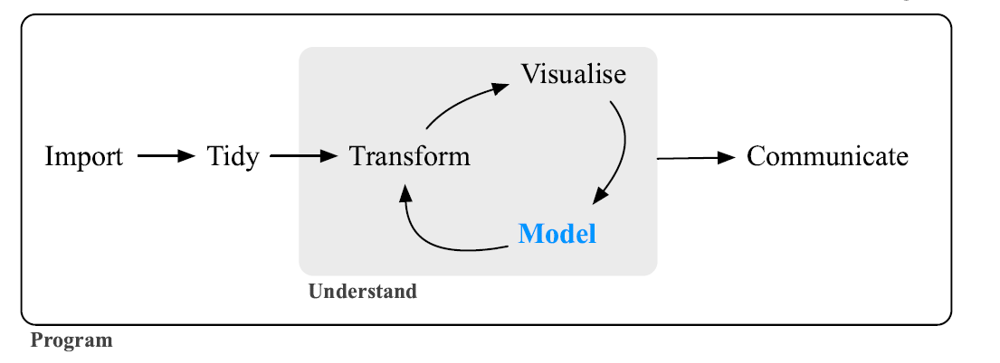

```{r setup, include=FALSE}
knitr::opts_chunk$set(echo = TRUE,warning = F,message = F)
```

<br><br>

# **Welcome Everyone!**

<br><br>

**The goal of today is to begin to understand the basics of the R package Tidymodels.**


There is a lot of possible information that can be provided on this topic and this workshop isn't meant to exhaust those resources. If you have questions throughout the workshop you can type them in the chat or I will be happy to meet with you afterwords. I am also willing to talk about the subject either through  email josesotelo2023@u.northwestern.edu or if you would like some help using Tidymodels for your own data, we do free [consults](https://app.smartsheet.com/b/form/2f2ec327e6164f83b588b7bbe2e2b56f) for all of your data science needs!


<br><br>


## Agenda for today

* A little background on modeling and Tidymodels
    
    + What is Tidymodels?

    + Types of models
    
    + Terminology
    
    + When modeling is used
    
    + What does the basic model workflow look like 
    
* Set up a simple regression model

    + Prep data
  
    + Create recipe
    
    + "Bake"
    
    + Fitting test data
    
    + Assessing fit
    
    + Other types of regression models
    

    
<br><br>
    
        
## **Tidymodels Background**

<br><br>

The tidymodels framework is a collection of packages for modeling and machine learning using tidyverse principles.


**Yes we are doing machine learning!**

Tidy Principals:

Reuse existing data structures.

Compose simple functions with the pipe.

Embrace functional programming.

Design for humans.

**We have various workshops on different aspects of the tidyverse like data cleaning and manipulation**


<br><br>

What packages come with tidymodels?


<br><br>


### **Types of models**

<br><br>

#### **Descriptive Models**

The purpose of a descriptive model is to describe or illustrate characteristics of some data. The analysis might have no other purpose than to visually emphasize some trend or artifact in the data.


#### **Inferential Models**


The goal of an inferential model is to produce a decision for a research question or to explore a specific hypothesis, similar to how statistical tests are used. An inferential model starts with some predefined conjecture or idea about a population, and produces a statistical conclusion such as an interval estimate or the rejection of a hypothesis.


#### **Predictive Model**


Sometimes data are modeled to produce the most accurate prediction possible for new data. Here, the primary goal is that the predicted values have the highest possible fidelity to the true value of the new data.

**Predictive models are what we will be focusing on today!**

<br><br>

### **Terminology**

<br><br>

**Unsupervised models** are those that learn patterns, clusters, or other characteristics of the data but lack an outcome.


**Supervised models** are those that have an outcome variable. Linear regression, neural networks, and numerous other methodologies fall into this category.


<br><br>

Within supervised models, there are two main sub-categories:

<br><br>

**Regression** predicts a numeric outcome.


Age is an example of this type of out

**Classification** predicts an outcome that is an ordered or unordered set of qualitative values.

Model of a car would be an example of this type of outcome  

<br><br>

### **When is Modeling Used?**

<br><br>




### **What does the Tidymodels process looks like**

<br><br>

There are many ways to go about the process of creating a model but I will be showing you the organization that I am most familiar with. This is definitely not the only way to do it though! One good thing about Tidymodels is that the process is flexible in certain ways. 


We will go over a couple of examples of this but the overall process looks like the chart bellow


<br><br>

## **Load Packages and Set Seed**

<br><br>

```{r,warning=FALSE,message=FALSE}

# Load packages here!
library(tidymodels)
library(tidyverse)
library(janitor)
library(skimr)
library(cowplot)
library(yardstick)
library(ranger)
library(glmnet)
library(vip)

# Set seed here!

set.seed(1192)

```
<br><br>

# **Regression Model**

<br><br>

For our regression model, we will be working with a data set from the UCI (University of California, Irvine) Machine Learning repository ([see website here](http://archive.ics.uci.edu/ml/datasets/Abalone)). The full data set consists of 4,177 observations of abalone (type of mollusk) in Tasmania. 


(Fun fact: [Tasmania](https://en.wikipedia.org/wiki/Tasmania "Tasmania") supplies about 25% of the yearly world abalone harvest.)


The age of an abalone is typically determined by cutting the shell open and counting the number of rings with a microscope. The purpose of this data set is to determine whether abalone age (**number of rings + 1.5**) can be accurately predicted using other, easier-to-obtain information about the abalone.


The full abalone data set is located in the `\data` subdirectory. Read it into *R* as a tibble. Take a moment to read through the codebook (`abalone_codebook.txt`) and familiarize yourself with the variable definitions.

<br><br>


## **Read in Data**

<br><br>

```{r}
abalone<-read.csv("data/abalone.csv")
```

<br><br>

## **Skim Data and Describe your Outcome Variable**

<br><br>

```{r}

abalone<-abalone%>%
  mutate(age=rings+1.5)

skim_without_charts(abalone)

ggplot(abalone,aes(x=age))+
  geom_histogram(bins=30)+theme_minimal()

```
<br><br>


## **Splitting Data for Regression Model**

<br><br>

Here we split our data so that we can train our model then later see how well our model can fit the rest of our data or our testing set. 

Here we choose to stratify our split. This impacts how we randomly sample our data into either our training or testing data. If not stratified then sets are 100% randomly sampled. if we choose to stratify our data is split into quartiles (can be changed) and then randomly sampled within each of those quartiles.

This can help with skewness in our outcome variable. One can imagine that if our age is highly skewed and a larger percentage of our training data is from the skewed side of the data, then our model might not be good at predicting data points that are at the other side of the data.

<br><br>

```{r}

abalone_split <- initial_split(abalone, prop = 0.75,strata = age)


abalone_split


abalone_train<-training(abalone_split)


abalone_test<-testing(abalone_split)

```
```{r}

strat_plot<-ggplot(abalone_test,aes(x=age))+
  geom_histogram(bins=30)+theme_minimal()

strat_plot

```


How might the testing or training data change is we don't stratify?


```{r}

abalone_split_ns <- initial_split(abalone, prop = 0.75)


abalone_split_ns


abalone_train_ns<-training(abalone_split_ns)


abalone_test_ns<-testing(abalone_split_ns)

```

```{r}

nostrat_plot<-ggplot(abalone_test_ns,aes(x=age))+
  geom_histogram(bins=30)+
  theme_minimal()

plot_grid(strat_plot,nostrat_plot,labels = c("Stratified", "Not Stratified"))
```

<br><br>

**Now you try!**
<br><br>

Make different testing and training data with different proportions and stratification to see if you can get any funky distribution.
<br><br>

How might this influence our models later?

Make sure to remove the eval=FALSE from the code below

```{r,eval=FALSE}

abalone_split_2 <- initial_split(abalone, prop =)


abalone_split_2


abalone_train_2<-training(abalone_split_2)


abalone_test_2<-testing(abalone_split_2)

```


```{r,eval=FALSE}

ggplot(abalone_test_2,aes(x=age))+
  geom_histogram(bins=30)+
  theme_minimal()

```

<br><br>

## **Regression Recipe**

<br><br>

Let's begin to construct our recipe for our model. First lets make a recipe with age as our outcome variable using all the other variables in our data. Because we constructed age using ring and there will be a highly correlated relationship we want to remove that variable from our recipe.

<br><br>

```{r}

abalone_recipe<-recipe(age ~ .,data = abalone_train)%>%
  step_rm("rings")

```

<br><br>

Next we might want to create dummy variables for our categorical data. We saw that we had one categorical variable named `type`.

<br><br>

```{r}

abalone_recipe<-recipe(age ~ .,data = abalone_train)%>%
  step_rm("rings")%>%
  step_dummy(type)


```

<br><br>

Next we might want to add interactions of some variable or normalize (center and scale) our data. We can do this with the code bellow. Note that because we created multiple dummy variables for `type` we will want to add the `starts_with()` function to include all those variables in our interaction

<br><br>

```{r}

abalone_recipe<-recipe(age ~ .,data = abalone_train)%>%
  step_rm("rings")%>%
  step_dummy(type)%>%
  step_interact(~starts_with("type"):shucked_weight+
                               longest_shell:diameter+
                               shucked_weight:shell_weight)%>%
  step_normalize(all_predictors())


```

<br><br>

## **Bake your Recipe**

<br><br>

This can show us what the training data will look like. I like to check to make sure that all my dummy coding, standardizing, and interactions appear in our training set. 

<br><br>

```{r}


prep(abalone_recipe, training = abalone_train)%>%
  bake(new_data=NULL)%>%
  head()
  

```
<br><br>

## **Choosing Models**

<br><br>

The scope of this workshop is not to chose which model might be best for a certain data set so for our regression data we will choose four simple models (Regression, Random forest, Lasso, Ridge). But there are many models (over 300) to choose from and they can be found [here](https://www.tidymodels.org/find/parsnip/)

<br><br>

```{r}

regression_model<-linear_reg()%>%
  set_engine("lm", importance="permutation")

```

<br><br>

## **Create your Workflow**

<br><br>

```{r}

regression_workflow<-workflow()%>%
  add_model(regression_model)%>%
  add_recipe(abalone_recipe)

```

<br><br>

## **Train your Model**

<br><br>

```{r}

regression_fit<-regression_workflow%>%
  fit(abalone_train)


tidy(regression_fit)
```
<br><br>

## **Predict with your Trained Model**

<br><br>

Use your `fit()` object to predict the age of a hypothetical female abalone with longest_shell = 0.50, diameter = 0.10, height = 0.30, whole_weight = 4, shucked_weight = 1, viscera_weight = 2, shell_weight = 1 .

```{r}
abalone_prediction<-tibble(type= "F",longest_shell = 0.50, diameter = 0.10, height = 0.30, whole_weight = 4, shucked_weight = 1, viscera_weight = 2, shell_weight = 1,rings=11)

predict(regression_fit, abalone_prediction)

```


## **Now it's your Turn!**

<br><br>

Try to enter values in the code bellow to try to predict a abalone younger that what I got above of 22.78. 

It is okay if you get errors in predicting because you might be choosing values that aren't in the data set. But keep changing the numbers to try to get a prediction!

**Hints**

Look at the skim of the data to look for possible values.

For `type` the only possible values are M,F, or I.

You might want to take a quick look at the coefficients above to see how our covariates influence our outcome variable

Make sure to remove the `eval=FALSE` from the top of your chunk


**Lets see who can get the youngest Mollusk**

<br><br>


```{r,eval=FALSE}
abalone_prediction_2<-tibble(type= ,longest_shell = , diameter = , height = , whole_weight = , shucked_weight = , viscera_weight = , shell_weight = ,rings=)

predict(regression_fit, abalone_prediction_2)

```

<br><br>

## **How well does your model predict the testing data?**

<br><br>

```{r}
abalone_metric<-metric_set(rmse,rsq,mae)

# rmse - root mean squared error 

# rsq - r squared 

# mae - mean absolute error

regression_assesment<-regression_fit%>%
  predict(new_data = abalone_test)%>%
  bind_cols(abalone_test%>%select(age))%>%
  abalone_metric(truth=age,estimate=.pred)%>%
  mutate(model="regular regression")

regression_assesment

```

<br><br>

# **Lets try Different Model Methods!**

<br><br>

## **Random Forest**

Random Forest Regression is a supervised learning algorithm that uses ensemble learning method for regression. Ensemble learning method is a technique that combines predictions from multiple machine learning algorithms to make a more accurate prediction than a single model.

```{r random forest}
# define random forest model

random_forest_model <- rand_forest(mode = "regression", mtry = 6, trees = 500) %>%
  set_engine("ranger",importance="permutation")

# define workflow 

random_forest_workflow<-workflow()%>%
  add_model(random_forest_model)%>%
  add_recipe(abalone_recipe)


# fit workflow

random_forest_fit<-random_forest_workflow%>%
  fit(abalone_train)


# assess performance

random_forest_assesment<-random_forest_fit%>%
  predict(new_data = abalone_test)%>%
  bind_cols(abalone_test%>%select(age))%>%
  abalone_metric(truth=age,estimate=.pred)%>%
  mutate(model="random forest")

```


## **Lasso Regression**


<br><br>

The word LASSO stands for Least Absolute Shrinkage and Selection Operator. It is a statistical formula for the regularization of data models and feature selection.


<br><br>

Lasso regression is a regularization technique. It is used over regression methods for a more accurate prediction. This model uses shrinkage. Shrinkage is where data values are shrunk towards a central point as the mean. The lasso procedure encourages simple, sparse models (i.e. models with fewer parameters). This particular type of regression is well-suited for models showing high levels of multicollinearity or when you want to automate certain parts of model selection, like variable selection/parameter elimination.

<br><br>

```{r lasso}
# define lasso model

# mixture = 1 specifies lasso; mixture = 0 for ridge
lasso_model <- linear_reg(penalty = 0.001, mixture = 1) %>% 
  set_engine("glmnet")

# define workflow 
lasso_workflow<-workflow()%>%
  add_model(lasso_model)%>%
  add_recipe(abalone_recipe)


# fit workflow

lasso_fit<-lasso_workflow%>%
  fit(abalone_train)


# assess performance

lasso_assesment<-lasso_fit%>%
  predict(new_data = abalone_test)%>%
  bind_cols(abalone_test%>%select(age))%>%
  abalone_metric(truth=age,estimate=.pred)%>%
  mutate(model="lasso regression")
```

<br><br>

## **Ridge Regression **

<br><br>

```{r ridge}


ridge_model <- linear_reg(penalty = 0.001, mixture = 0) %>% 
  set_engine("glmnet")

# define workflow 
ridge_workflow<-workflow()%>%
  add_model(ridge_model)%>%
  add_recipe(abalone_recipe)


# fit workflow

ridge_fit<-ridge_workflow%>%
  fit(abalone_train)


# assess performance

ridge_assesment<-ridge_fit%>%
  predict(new_data = abalone_test)%>%
  bind_cols(abalone_test%>%select(age))%>%
  abalone_metric(truth=age,estimate=.pred)%>%
  mutate(model="ridge regression")

```

<br><br>


After assessing the performance of these 4 methods, which do you think is best? 

```{r}

final_model_assesments<-regression_assesment%>%
  bind_rows(random_forest_assesment)%>%
  bind_rows(lasso_assesment)%>%
  bind_rows(ridge_assesment)%>%
  filter(.metric=="rmse")%>%
  arrange(.estimate)

final_model_assesments

```

In this case we are using residual mean squared error to gauge model fit. You can ask for multiple type of fit statistics but for simplicity here I am only choosing one. We see that of the four models we ran, our random forest seems to have the lowest rmse which is one way to compare fit.


<br><br>

## **Now It's Your Turn!**

<br><br>

With the code below, try to create a random forest model with different hyperparameters that has a better fit (lower rmse) than the model be just made. 


For some guidance, here are what the three hyperperameters for random forest are

`mtry`
An integer for the number of predictors that will be randomly sampled at each split when creating the tree models.

`trees`
An integer for the number of trees contained in the ensemble.

`min_n`
An integer for the minimum number of data points in a node that are required for the node to be split further.

Make sure you remove eval=false and also numbers that are too large might night allow your model to run


**Let's see who can get the best rmse!**

<br><br>


```{r your random forest,eval=FALSE}
# define random forest model

random_forest_model_2 <- rand_forest(mode = "regression", mtry = , trees = ,min_n = ) %>%
  set_engine("ranger")

# define workflow 

random_forest_workflow_2<-workflow()%>%
  add_model(random_forest_model)%>%
  add_recipe(abalone_recipe)


# fit workflow

random_forest_fit_2<-random_forest_workflow%>%
  fit(abalone_train)


# assess performance

random_forest_assesment_2<-random_forest_fit_2%>%
  predict(new_data = abalone_test)%>%
  bind_cols(abalone_test%>%select(age))%>%
  abalone_metric(truth=age,estimate=.pred)%>%
  mutate(model="your random forest")

```

<br><br>

```{r,eval=FALSE}

your_model_assesment<-regression_assesment%>%
  bind_rows(random_forest_assesment)%>%
  bind_rows(random_forest_assesment_2)%>%
  filter(.metric=="rmse")%>%
  arrange(.estimate)

your_model_assesment

```


## Model Refinement

<br><br>

Let's see which of the variables were most important in prediction and see whether we can create a better model with just the top variables

<br><br>

```{r}
fit<-extract_fit_engine(random_forest_fit)

vip(fit)

```


Lets make a recipie with just the most important variable


```{r}

abalone_recipe_refined<-recipe(age ~ shell_weight+shucked_weight+whole_weight,data = abalone_train)%>%
  step_normalize(all_predictors())


```

```{r}


random_forest_model_refined <- rand_forest(mode = "regression", mtry = 3, trees = 600) %>%
  set_engine("ranger",importance="permutation")


random_forest_workflow_refined<-workflow()%>%
  add_model(random_forest_model_refined)%>%
  add_recipe(abalone_recipe_refined)


random_forest_fit_refined<-random_forest_workflow_refined%>%
  fit(abalone_train)


random_forest_assesment_refined<-random_forest_fit_refined%>%
  predict(new_data = abalone_test)%>%
  bind_cols(abalone_test%>%select(age))%>%
  abalone_metric(truth=age,estimate=.pred)%>%
  mutate(model="random forest refined")

```


Lets compare to our other random forrest!

```{r}

refined_model_assesments<-random_forest_assesment_refined%>%
  bind_rows(random_forest_assesment)%>%
  filter(.metric=="rmse")%>%
  arrange(.estimate)

refined_model_assesments

```
We see that only using the most important variables we have a less accurate model sometimes the variables that aren't as important can account for unique variability 

That is all I have for today! Thank you and I will see you on Thursday!
